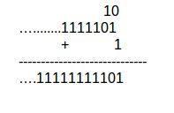

# Principios de diseño de arquitectura
## Segundo principio de diseño de hardware: Entre más pequeños más rápido.
### Operandos de memoria.

Cuando el procesador necesita utilizar la información que se encuentra en una estructura compleja de datos se hace necesesario el llamado a memoria. Para realizar este tipo de accesos necesitamos utilizar instrucciones conocidas como instrucciones de tranferencias de datos.

En nuestra arquitectura **SPARC V8** tenemos las instrucciones **ld** (LOAD) y **st** (STORE), cada una tiene la capacidad de manejar datos de **32 bits**.

la manera en como se usa las instrucciones de memoria de la arquitectura **SPARC V8** es de la siguiente manera:

- ld[**address**],regrd
- st regrd, [**address**]

Un **address** puede ser (**r[rs1] + r[rs2]**) ó (**r[rs1]+imm**)

La arquitectura de **SPARC V8** maneja un direccionamiento por **byte**, de esta manera cada posición de memoria almacena **32 bits** o **4 bytes**.

### EJEMPLO.

- A = B + C[9]
Lo primero que debemos hacer es asignarle los registros a las variables, en este caso a **A, B, C**.
Una vez le halla asigando los registros:**A = %l0**,  **B = %l1**, **C = %l2**. Debo usar una intrucción de tranferencia que me carge el dato que esta contenido en C[9]; para ello usa la instrucción **LOAD**.
- ld[%l2+(9*4)],%l3
- add %l1,%l3,%l0
## Tercer principio de diseño de hardware: Hacer el caso común más rápido.

### Operandos contantes o inmediatos.
Generalmente son los valores que se le asignan a una variable cuando la inicializamos o cuando se usan ciclos.

- r[rs1], imm, r[rd]
#### EJEMPLO
- A = 5
- add %l0,5,%l2
### Números con signo y sin signo.
##### Signo con magnitud:
No tuvo mucha aplicación en el hardware debido a la notación, pues era más dificil de implementar.

##### Complemento a 2:

- +2 ----> 00000000000000000000000000000010
- -2 ----> niego el número positivo y a esa negación le sumo 1. 

