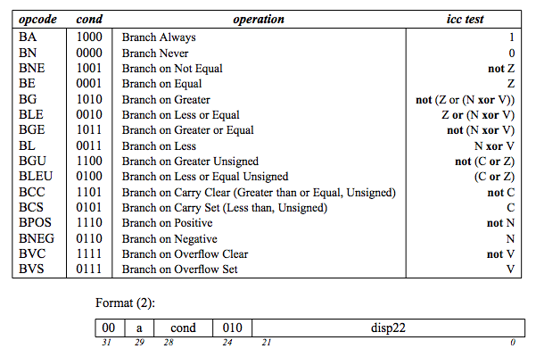

# Categorías de las Intrucciones
Las instrucciones SPARC V8 se pueden agrupar en seis categorías:  

+ Load/Store (carga / almacenamiento)
+ Aritmético-lógicas
+ **CTI(Control Transfer Instruction - Instrucciones de control de tranferencia )**
+ Acceso a registros de estado
+ Instrucciones de unidad de punto flotante
+ Intrucciones de co-procesador

## Instrucciones de control de transferencia (CTI).
 Las instrucciones de control de tranferencia se conforman por instrucciones que modifican el **nPC**. (Next program Counter)**nPC** es un registro de 32 bits que contiene las dirección de la próxima instrucción a ejectutar. Las instrucciones de control de tranferencia son: 
 
 - Ramas condicionados **Branch** (**Bicc, FBfcc,CPccc**)
 - Llamados **Call and Link** (**CALL**)
 - Saltos **Jump and Link**(**JMPL**)
 - Retorno de excepciones **Return from Trap**(**RETT**)
 - Excepciones **Trap** (**TIcc**)
 
Las instrucciones de control de transferencia puedes ser categorizadas, acorde como se muestran en la tabla, además la dirección destino es calculada teniendo en cuenta (PC-relativo vs. register-indirect) y el tiempo relativo que toma la trasnferencia con respecto al (non delay,vs. delay vs. condicional-delay).
 
 Categorias instrucciones de control de transferencia:
 
 
 
 Para entender esta tabla dirijase a la página 51 del manual de la arquitectura **SPARC V8**.
 
 
 
 ### Branch
 #### Formato 2 ---> OP = 00 ---> 0.
  
 
 
 ### CALL
 #### Formato 1 ---> OP = 01 ---> 1.
  
  
 ### JMPL
 #### Formato 3 ---> OP = 10 ---> 2.
  
 
 
 
 
 
 
 

